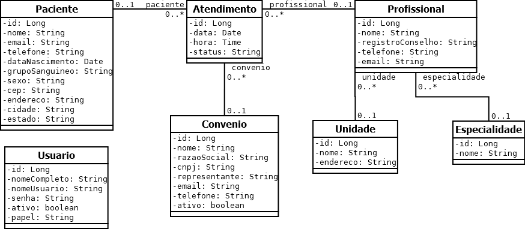

# frameworks-front-end
Repositório da disciplina Frameworks Front-end

# Dependências do projeto

As dependências do projeto não são compartilhadas no repositório. Para instalar as dependências, a partir da raiz do projeto, no prompt de comandos, digite: ```npm install```.

# Sites de referência

- Angular Docs: https://angular.io/docs
- TypeScript Documentation: https://www.typescriptlang.org/docs/
- MDN Web Docs - Aprendendo desenvolvimento: https://developer.mozilla.org/pt_BR/docs/Learn
- Using Angular in Visual Studio Code: https://code.visualstudio.com/docs/nodejs/angular-tutorial

# Ferramentas

- **Visual Studio Code**
  - https://code.visualstudio.com/Download
- **Angular Language Service (Extensão do VS Code)**
  - https://marketplace.visualstudio.com/items?itemName=vscjava.vscode-java-pack
- **Git**
  - https://git-scm.com/downloads
- **Node.js (e npm)**
  - Versão 14.15 ou superior.
  - Para verificar a versão do Node.js, no prompt de comandos digite:
    - ```node --version```
  - Link para download (escolha a versão LTS): https://nodejs.org/en/download/
- **Angular CLI:**
  - Versão 14.0 ou superior.
  - Para verificar a versão do Angular CLI, no prompt de comandos digite:
    - ```ng --version``` ou ```ng version```
  - Tutorial de instalação: https://angular.io/guide/setup-local
  - Para instalar o Angular CLI, no prompt de comandos digite:
    - ```npm install -g @angular/cli```

# SGCM - Diagrama de Classes



# SGCM - Diagrama Entidade Relacionamento


